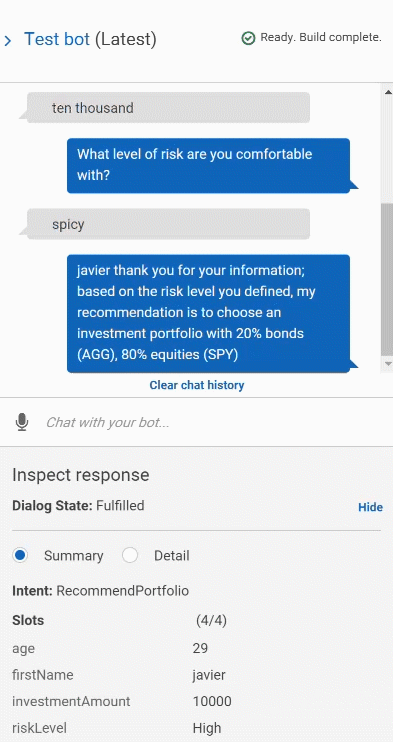

# AWS Lex RoboAdvisor

Using Amazon Lex to create a simple Investment Portfolio Advisor bot

## Premise

---

The Roboadvisor is a simple proof of concept that used AWS's chatbot framework, Lex, to ask a few simple questions.
After the user answers name, age, how much money they want to invest and their risk level, the information is sent to an Amazon Lambda instance running a custom python script that references a predefined list of simple portfolio arrangements and offers the most appropriate one to the user.

The files onctained in this repository can be used to recreate this, or a similar chat bot.

[lambda_function.py](/lamda_function.py) - contains the python code for the Amazon Lambda instance

[Test Cases](/Test_Cases) - contains four error checking files that submit different scenarios to the lambda function and verify it works.

Below is a video clip of the chat bot in action:

